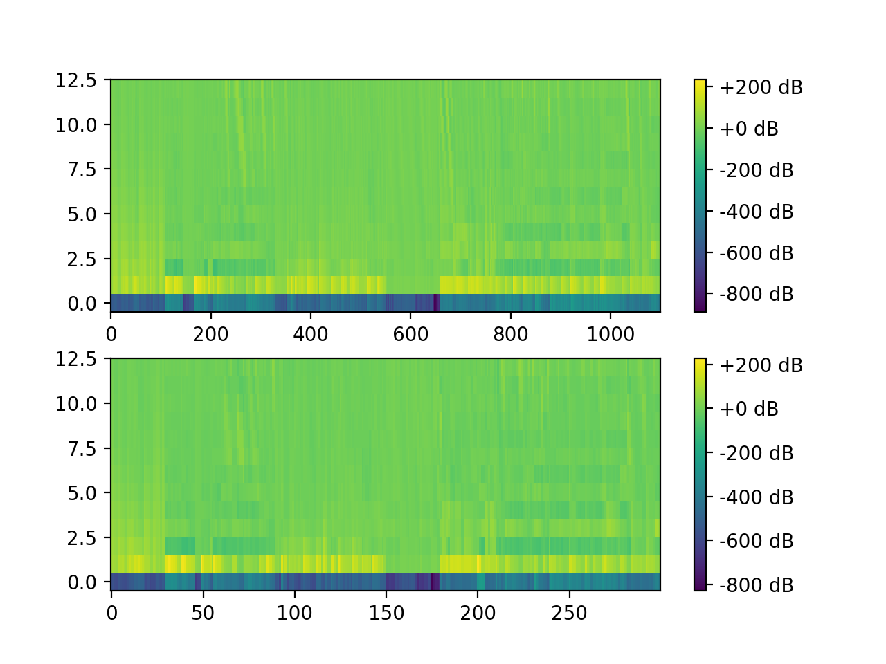

# Musical Instrument Recognition

Jiyun Park

GCT634: Musical Application of Machine Learning (Prof. Juhan Nam)

Submission Date: 2021/09/26

---

## Abstract

The goal of the project is, given datasets with short audio(`.wav`) file of ten different musical instruments, classifying each dataset into valid musical instrument family. Mainly, the task is divided into a task of audio feature extraction, task of summarizing features, and task of classification.
Over a dataset of 1100 tones from 10 musical instruments, features such as MFCC, RMS, Zero crossing rate, spectral centroid, spectral bandwidth have been used for extracting feature information.
On top of these extracted features, 5 classification methods are implemented and tested (SGD, K-NN, NuSVC, MLP, and GMM). All classifiers have their hyper parameters adjusted to have over 90% accuracy. The highest accuracy was 98% by NuSVC model, followed by 97.67% by MLP classifier model.


## Feature Extraction

```shell
$ python feature_extraction.py
extracting mfcc from ./dataset/train_list.txt
100%|█████████████████████████████████████████████████████████████████████████████████████| 1100/1100 [02:12<00:00,  8.33it/s]
extracting mfcc from ./dataset/valid_list.txt
100%|██████████████████████████████████████████████████████████████████████████████████████| 300/300 [00:38<00:00,  7.70it/s]
```

`feature_extraction.py` loads audio files and extracts spectral features and stores them in `./mfcc` directory.

In order to extract feature that characterizes each musical instrument, the following aspects can be considered.

- loudness
- continuity of a sound (ex. piano striking vs. flute vibration)
- unique timbre


## Feature Summary

```shell
$ python feature_summary.py
```


> In order to just plot MFCC visually in 13 dimensions in the image above, only the MFCC feature was extracted for convenience. The original code extracts much more features other than MFCC.

For summarizing features, mean pooling in time domain is conducted.

## Train & Test

```shell
$ python train_test.py
[SGD]
                classifier            hyper param    accuracy
===============================================================
SGDClassifier(random_state=0)         alpha=0.0001   95.333
...

[K-NN]
                                  classifier                    hyper param                           accuracy
==============================================================================================================
KNeighborsClassifier(n_neighbors=10)                           algorithm=auto, weight=uniform         93.333
KNeighborsClassifier(n_neighbors=10, weights='distance')       algorithm=auto, weight=distance        94.333
...

[NuSVC]
          classifier                   hyper param         accuracy
=====================================================================
NuSVC(kernel='linear', nu=0.1)    nu=0.1, kernel=linear    95.667
NuSVC(kernel='poly', nu=0.1)      nu=0.1, kernel=poly      97.333
NuSVC(nu=0.1)                     nu=0.1, kernel=rbf       98
...

[MLP]
                       classifier                          hyper param                                          accuracy
===========================================================================================================================
MLPClassifier(alpha=0.01, learning_rate='constant')        alpha=0.01, solver=adam, learning_rate=constant      97.333
MLPClassifier(alpha=0.001, learning_rate='invscaling')     alpha=0.001, solver=adam, learning_rate=invscaling   97.667
...

[GMM]
        classifier            hyper param   accuracy
=======================================================
GaussianProcessClassifier()                 97
```

`train_test.py` runs whole traning process of 5 classifier models, and displays out the each accuracy with certain parameters.

5 different classification models are applied to train and test musical instrument classification. The result of accuracy of training is summarized in the table below.

classifier | hyper parameter | highest accuracy
--- | --- | ---
SGD | `alpha=0.001` | 95.333%
K-NN | `weight='distance'` | 94.333%
**NuSVC** | `nu=0.1, kernel='rbf'` | **98%**
MLP | `alpha=0.001, solver='adam', learning_rate='invscaling'` | 97.667%
GMM | `kernel='1.0 * RBF(1.0)', optimizer='fmin_l_bfgs_b'` (default) | 97%

## Discussion & Insights
- Extracting spectral flatness does not affect the training when there's no white noise in the datasets.
- Even if additional feature extraction does not increase the maximum accuracy of classification, the accuracy can be generally improved among most of models if the features are sufficiently extracted to reflect the characteristics of each instrument.
